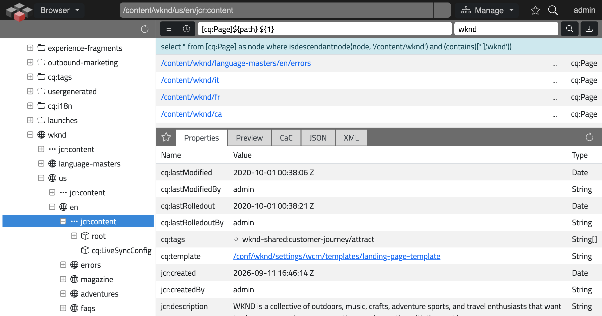

# Composum Tools

[](https://opensource.org/licenses/MIT)

A lightweight, dependency-minimal framework for building a customizable set of maintenance and
development tools for an Apache Sling or AEM (incl. AEM as a Cloud Service) instance — a JCR
resource browser, a Felix Web Console proxy, and a tile-based dashboard to arrange them on.


*Placeholder — JCR browser with properties view*

## Background

Composum Tools is a from-scratch, purpose-built successor to two older, independently maintained
projects:

- the full [Composum Nodes](https://github.com/ist-dresden/composum-nodes) JCR browser,
  including many features (user management, Groovy console, ACL editor, ...) that have not been
  migrated yet, but will be added later if useful or necessary. Its package manager *has* been
  migrated — see [Package Manager](#package-manager) below.
- the more lightweight [Composum Dashboard](https://github.com/ist-dresden/composum-dashboard),
  an earlier attempt at replacing Nodes with a tile-based framework for arranging a small set of
  read-only tools.

Both projects are being **replaced** by `tools`. The goals of the rewrite are:

- **Less maintenance** — one small codebase with a minimal installation and repository footprint.
- **Fewer dependencies** — built against a minimal Sling API surface plus Jackson (already part
  of both the AEM and the plain Sling Starter feature set); no Gson (no longer supported on AEM),
  no JCR content package for the UI itself — the whole UI is plain Java/OSGi bundle code.
- **Only what is actually used** — instead of porting every feature of Nodes/Dashboard, `tools`
  implements only the subset that is genuinely needed here: browsing/inspecting resources,
  running queries, exporting results, and a couple of read-only Felix Console views.

If a feature you relied on in Nodes or Dashboard is missing here, that is intentional — please
raise it so it can be added deliberately, rather than carried forward "just in case".

## Features

### Browser

A JCR/Sling resource browser: a tree on the left (`.browser.tree.json`), a set of pluggable
**tools** above it, and a set of pluggable **views** plus **actions** on the right for the
selected resource.

**Tools** (left-hand panel):

- **Favorites** — a configurable, regex-driven set of quick-access root paths (e.g. `/content`,
  `/conf`, `/apps`), plus a "recently visited" history.
- **Query** — runs JCR-SQL2 or XPath queries (with a configurable list of query templates),
  shows the results as a table, and offers **streaming JSON and CSV export** with configurable
  CSV columns.

**Views** (per-resource detail tabs):

- **Properties** — full property listing of the selected resource, including binary download of
  `jcr:data`.
- **Display** — renders the resource directly in an iframe; on AEM author instances this adds
  `wcmmode=disabled` and an authoring parameters panel.
- **JSON** / **XML** — a recursive dump of the resource subtree, with an optional "source mode"
  that hides repository noise (`jcr:uuid`, `jcr:created`, `cq:lastReplicated*`, ...).
- **CA Config** — shows resolved Sling Context-Aware Configuration values for the selected
  resource, restricted to a configurable set of configuration types.

**Actions**: *View* (open in a new tab) everywhere; on AEM author instances additionally *Edit*
(page editor), *Manage* (Assets/Sites console) and *Activate*/*Deactivate* (replication).

### Dashboard

A single overview page (`Page`/`Tile` widgets) listing all enabled tools as tiles, each linking
to its detail page. Every module below contributes its own widget automatically once enabled.
**Requires an OSGi configuration to activate** — see
[Activation: opt-in by design](#activation-opt-in-by-design) below.

### Package Manager

Browses, installs, uninstalls and deletes FileVault content packages — a tree on the left
(group/name/version), the selected package's details and actions on the right; selecting a
group or name folder instead of a version shows every package nested under it, with a **Purge
Old Versions** action that deletes every version except the latest of each package found there.
Requires FileVault (`org.apache.jackrabbit.vault`) to actually be installed; the component simply
does not activate otherwise, and installs no extra dependency footprint of its own beyond the
(optional, `provided`) compile-time API. **Also requires an OSGi configuration to activate** —
see [Activation: opt-in by design](#activation-opt-in-by-design) below; this matters in
particular here, since a package manager rarely makes sense on e.g. a Publish instance. Two
backends, switched with a mode toggle (`?mode=jcr|registry`, a full page reload — there is no
live in-place switch):

- **JCR mode** (default) — the classic, single-source `JcrPackageManager` (`/etc/packages`).
  Supports the full lifecycle: **Create**, **Upload**, **Edit** (description, AC handling,
  dependencies, replaces, provider info, requires-restart/-root), **Filters** (workspace filter
  roots, one `/path` or `/path;importMode` per line — order is filter order), **Install**,
  **Uninstall**, **Build** (assemble the package from its filter), **Coverage** (dumps every
  repository path the filter would touch), **Download**, **Delete**.
- **Registry mode** — every bound FileVault `PackageRegistry` OSGi service (merged into one
  tree). The SPI is read/install/uninstall/remove only, so **Create/Upload/Edit/Filters/Build**
  are not available here — only **Install**/**Uninstall**, **Download**, **Delete**.

Install/uninstall/build run **synchronously** on the request thread — there is deliberately no
async job queue and no persisted audit trail or install history; the operation's log is only
ever returned in the HTTP response of the request that triggered it.

A **CRX Package Manager compatibility endpoint** (`POST .packages.service.html`) reimplements the
classic `/crx/packmgr/service.jsp` wire protocol (`cmd=ls|rm|build|uninst`, or upload+install when
a `file` is posted without a `cmd`) for Maven deployment tooling (`content-package-maven-plugin`
and forks) that still speaks it — point such a plugin's `serviceURL` here.

Dialogs (Create/Upload/Edit/Filters/Install/Uninstall/Build/Purge confirmations) use a small,
generic, reusable client-side framework (`CPM.Dialog` / `DialogForm` in `sling/tools/script.js`,
not specific to the Package Manager): a dialog's HTML fragment is fetched on demand when it is
opened and removed from the DOM again once it is closed (cancelled or successfully submitted) —
no dialog markup is ever left lingering in the page.

### Console (AEM only)

Embeds selected read-only [Felix Web Console](https://felix.apache.org/documentation/subprojects/apache-felix-web-console.html)
plugins (Requests, JCR Resolver, Servlet Resolver) inside the tools UI, rewriting their internal
resource/content links so they work without direct access to `/system/console` — useful on
AEMaaCS, where that console is not reachable. **Requires an OSGi configuration to activate** —
see [Activation: opt-in by design](#activation-opt-in-by-design) below.

## Getting started

### Module layout

```
tools/
├── sling/
│   ├── bundle/    the core framework + Dashboard + Browser (works on plain Sling and on AEM)
│   └── package/    a content package wrapping the sling/bundle, for package-manager based installs
└── aem/
    ├── bundle/    AEM-specific extensions (author-only Edit/Manage/Activate actions, Felix
    │              Console proxy, AEM-aware Display view and platform config) — depends on sling/bundle
    └── package/    a content package wrapping the aem/bundle
```

Every module is a plain OSGi bundle; there is no JCR content to install for the UI itself, so a
`bundle` module deployed to a running instance is enough to use the tools. The `package` modules
exist only for environments where content-package based deployment (rather than direct bundle
install) is the required workflow. The AEM bundle already embeds the Sling bundle, so for an
AEM installation only that single bundle needs to be deployed.

### Building

```bash
mvn clean install
```

Deploy directly to a running instance during development (adjust host/port via the usual
`sling.host`/`sling.port` properties if needed):

```bash
# plain Sling instance
mvn -pl sling/bundle -am -P installBundleSling install

# AEM author instance
mvn -pl aem/bundle -am -P installBundleAEM install

# AEM publish instance
mvn -pl aem/bundle -am -P installBundleAEMPublish install
```

Publishing a release to Maven Central uses the `deploy-central` profile (see `pom.xml`).

### Usage

Once the bundle(s) are active, open (default servlet path `/apps/cpm/tools`, configurable):

| URL | Page |
|---|---|
| `/apps/cpm/tools.dashboard.html` | Dashboard overview |
| `/apps/cpm/tools.browser.html` | JCR Browser |
| `/apps/cpm/tools.packages.html` | Package Manager |
| `/apps/cpm/tools.console.html` | Felix Console proxy (AEM only) |

## Configuration & customization

Every building block (`Dashboard`, `Browser`, `Favorites`, `Query`, each `View`, `DefaultActions`
/ `AemActions`, each `ConsoleProxy`, ...) is a separate OSGi component with its own
`@ObjectClassDefinition`, configurable per environment (author/publish/dev/...) through the usual
OSGi configuration mechanism.

### Activation: opt-in by design

**`Browser` is the only top-level page that activates on its own**, with no OSGi configuration
present at all — it is the part of the toolset that is virtually always wanted, so there is
deliberately no extra step between deploying the bundle and being able to use it.

**Every other top-level page — `Dashboard`, `PackageManager`, and `Console` (AEM only) —
requires an explicit OSGi configuration to activate**
(`configurationPolicy = ConfigurationPolicy.REQUIRE`); without one, the component simply does not
start, and its page/tile/proxy is not registered anywhere. An **empty configuration (`{}`) is
enough** — this is not about setting any particular value, it is a deliberate per-instance
opt-in: which of these makes sense varies by environment (a package manager, in particular, is
rarely wanted on a Publish instance), so the decision is left to whoever configures each
instance rather than being made once for every deployment. Create the configuration via the
usual OSGi config mechanism (`/system/console/configMgr`, a `.cfg.json` file, a Sling
`ConfigurationAdmin` factory, ...) under the component's PID (e.g.
`com.composum.sling.packages.PackageManager`).

The most commonly adjusted settings, once a component is active:

- **Enable/disable** a whole module: `Browser.Config#tools()` / `Browser.Config#views()` — empty
  means "all enabled", otherwise only the listed keys are active. Same pattern (`enabled()`) on
  `Dashboard`, `ConsoleProxy` implementations, etc.
- **Access restrictions**: `Server.Config#allowedPathPatterns()` / `disabledPathPatterns()` and
  `allowedPropertyPatterns()` / `disabledPropertyPatterns()` — regex allow/deny lists applied
  repository-wide, before any view or export renders a resource or property.
- **Favorites**: `Browser.Config#favorites()` — `label=regex` pairs.
- **Query templates & CSV export columns**: `Browser.Config#queryTemplates()` and
  `Browser.Config#queryCsvProperties()` (the latter as `column[=candidate1|candidate2|...]`,
  first matching property wins).
- **Exposed CA configurations**: `Browser.Config#caConfigurations()`.
- **JSON/XML "source mode" noise filters**: `JsonView.Config#nonSourceProperties()` /
  `nonSourceMixins()` (and the equivalent on `XmlView`).
- **Package Manager write access**: `PackageManager.Config#writeEnabled()` — `false` makes it a
  read-only browser/installer-of-nothing (Create/Upload/Edit/Filters/Install/Uninstall/Build/
  Delete all return `403`, listing/viewing/downloading/coverage stay available).

For extension beyond configuration — a new tool, view, action set or console proxy — implement
the relevant small interface (`Tool`, `View`, `Actions`, `ConsoleProxy`) as its own OSGi
component; it registers itself with the framework via `PluginSet#attach()`/`#detach()` in its
`@Activate`/`@Deactivate` methods, exactly like the built-in ones (see e.g.
[`Favorites`](sling/bundle/src/main/java/com/composum/sling/browser/tool/Favorites.java) or
[`JsonView`](sling/bundle/src/main/java/com/composum/sling/browser/view/JsonView.java) as a
template). A whole new top-level page (its own `ToolsPlugin`, like Browser/Dashboard/Package
Manager) is the same idea one level up — see
[`PackageManager`](sling/bundle/src/main/java/com/composum/sling/packages/PackageManager.java)
as the most recently added example, including how it gates its own optional dependency
(`Packaging`/FileVault) via a plain mandatory `@Reference`.

Note that all HTML templates and static assets (JS/CSS/icons) are plain Java classpath resources
bundled *inside* the OSGi bundle — there is deliberately no JCR content package backing the UI.
Visual/markup customization therefore means adjusting the bundle sources (e.g. in a fork or a
downstream module providing overriding components), not overlaying content under `/apps`.

## License

MIT — see [`LICENSE`](LICENSE).

## See also

- [Composum Nodes](https://github.com/ist-dresden/composum-nodes) — the full-featured JCR
  browser this project's Browser is a reduced, purpose-built alternative to.
- [Composum Dashboard](https://github.com/ist-dresden/composum-dashboard) — the tile-based
  framework this project's Dashboard is a reduced, purpose-built alternative to.
